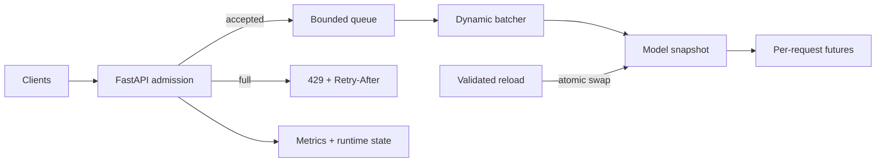

# Distributed ML Inference

[](https://github.com/cagataykavas/distributed-ml-inference/actions/workflows/ci.yml)

A production-shaped Python inference runtime focused on the hard part around a model: **bounded admission, cancellation-safe dynamic batching, deadlines, lifecycle-safe shutdown, atomic model reloads, observability and reproducible SLO evidence**.

The bundled NumPy classifier is deliberately deterministic. The engineering subject is the serving control plane, not a fabricated accuracy claim.

## Runtime architecture



One request has exactly one terminal outcome. A queue-full request is rejected immediately instead of hiding in unbounded memory; a cancelled or expired queued future is removed from model work; a predictor contract failure fails the complete batch without killing the worker.

## Guarantees encoded in tests

| Concern | Runtime behavior | Evidence |
|---|---|---|
| Overload | `put_nowait` against a configured capacity; HTTP 429 with `Retry-After` | deterministic saturation test |
| Cancellation | cancelled queued futures are filtered before model execution | predictor input assertion |
| Deadline | end-to-end timeout cancels the future; later batches recover | timeout/recovery test |
| Event loop | synchronous predictors execute via `asyncio.to_thread` | blocked-model ticker test |
| Batch contract | output count must equal active input count | worker recovery test |
| Shutdown | readiness closes before drain/cancel; queued futures receive a terminal error | lifecycle tests |
| Reload | candidate warm-up precedes an atomic snapshot swap | in-flight old/new version test |
| Bad model | non-finite candidate parameters never replace the active generation | quarantine test |

## API surface

| Method | Path | Purpose |
|---|---|---|
| `GET` | `/health` | process liveness only |
| `GET` | `/ready` | admission readiness, model generation and capacity |
| `GET` | `/runtime` | queue/in-flight/counter snapshot |
| `POST` | `/predict` | deadline-bound inference |
| `POST` | `/admin/models/reload` | authenticated, validated atomic model swap |
| `GET` | `/metrics` | Prometheus request, latency, queue and generation metrics |

Model reload is disabled unless `INFERENCE_ADMIN_TOKEN` is set. The token is compared with `secrets.compare_digest`; invalid candidates are warmed up and rejected before publication.

```bash
pip install -e '.[dev]'
uvicorn inference.service:app --reload

curl -s http://localhost:8000/predict \
  -H 'content-type: application/json' \
  -d '{"features": [0.8, 0.2, 0.5, -0.1]}'
```

## Configuration

| Environment variable | Default | Meaning |
|---|---:|---|
| `INFERENCE_MAX_BATCH_SIZE` | 32 | maximum active requests per model call |
| `INFERENCE_MAX_WAIT_MS` | 5 | batch coalescing latency budget |
| `INFERENCE_MAX_QUEUE_SIZE` | 256 | hard admission capacity |
| `INFERENCE_REQUEST_TIMEOUT_MS` | 2000 | request deadline including queue time |
| `INFERENCE_SHUTDOWN_TIMEOUT_MS` | 5000 | graceful drain budget |
| `INFERENCE_ADMIN_TOKEN` | unset | enables protected reload endpoint |

## SLO-gated load evidence

`load_test.py` writes a machine-readable JSON report containing request totals, status distribution, throughput, success rate, and p50/p95/p99/max latency. It exits non-zero when either the latency or success-rate budget fails.

```bash
python load_test.py \
  --requests 1000 \
  --concurrency 100 \
  --max-p95-ms 250 \
  --min-success-rate 0.99 \
  --output artifacts/load-report.json
```

CI also runs an in-process deterministic reference profile and uploads `inference-reference-evidence`. This is regression evidence for the implementation—not a cloud capacity claim.

## Model boundary and reload semantics

`ModelAdapter` exposes a typed `predict_batch` contract. `ModelManager` stores an immutable generation snapshot. A batch captures that snapshot once; if a reload completes while the batch is executing, every item in that batch still reports the old version and the following batch uses the new version. ONNX Runtime, PyTorch, TensorRT or a remote endpoint can implement the same boundary.

## Packaging and deployment

The multi-stage container builds a wheel, installs only runtime dependencies, runs as UID `10001`, and exposes a liveness healthcheck. One Uvicorn worker is intentional because the queue and model generation are process-local; horizontal scale should use replicas.

`infra/aws/` describes the surrounding VPC, public/private subnet separation, ALB-to-service security boundary, ECR and ECS cluster. `docs/networking.md` records routing and autoscaling tradeoffs. Infrastructure is an explicit deployment mapping, not proof that synthetic benchmarks represent a particular GPU instance.

## Repository map

```text
batcher.py                  bounded batching runtime + lifecycle
inference/config.py         validated environment configuration
inference/model.py          deterministic model adapter
inference/runtime.py        versioned atomic model snapshots
inference/service.py        app factory, HTTP policy, metrics
load_test.py                external SLO-gated load runner
reference_benchmark.py      deterministic CI evidence producer
tests/                      concurrency, lifecycle, API and SLO tests
infra/aws/                  deployment topology
```

## Verification

```bash
ruff check .
ruff format --check .
pytest -q
python -m build
python reference_benchmark.py
docker build -t distributed-ml-inference .
```

CI verifies source quality, 18 behavioral tests, an isolated wheel import, SLO artifact generation, a multi-stage image build and a live container readiness probe.
