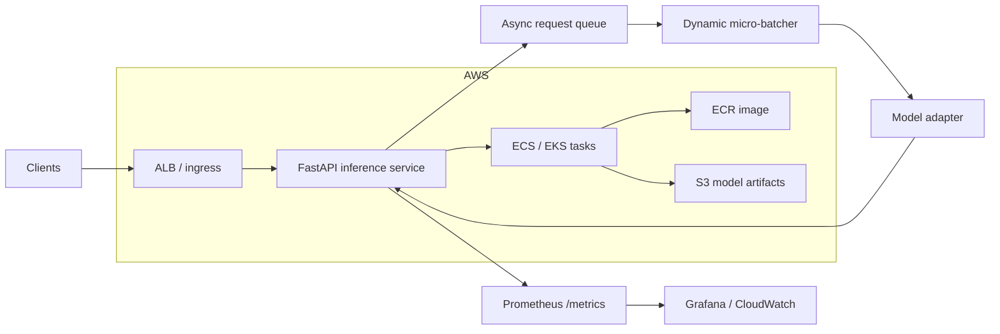

# Distributed ML Inference

A runnable ML-serving project built around **async request handling, dynamic micro-batching, versioned model adapters, Prometheus metrics, load testing and AWS deployment infrastructure**.

The point of this repository is not the toy classifier. The interesting part is the **serving system around the model**.

## Architecture



## Why dynamic batching?

GPU/accelerator inference is usually more efficient when multiple requests are executed together, but waiting too long to build a large batch damages latency. The service therefore uses a bounded policy:

- collect the first request immediately;
- wait up to a small latency budget (`max_wait_ms`);
- stop as soon as `max_batch_size` is reached;
- execute one `predict_batch` call;
- route each output back to its original request future.

The current defaults are **32 requests / 5 ms** and are intentionally configurable in code.

## Service endpoints

```text
GET  /health    liveness
GET  /ready     batch-worker + model metadata readiness
POST /predict   inference
GET  /metrics   Prometheus metrics
```

Start locally:

```bash
pip install -e '.[dev]'
uvicorn inference.service:app --reload
```

Request:

```bash
curl -X POST http://localhost:8000/predict \
  -H 'content-type: application/json' \
  -d '{"features": [0.8, 0.2, 0.5, -0.1]}'
```

Example response:

```json
{
  "score": 0.62,
  "label": 1,
  "model": "synthetic-risk-model",
  "version": "2026.08",
  "latency_ms": 5.8
}
```

## Model adapter

`inference/model.py` defines a tiny adapter boundary. The included NumPy model makes CI deterministic, while the same `predict_batch` interface can be implemented by:

- PyTorch;
- ONNX Runtime;
- TensorRT;
- Triton client;
- SageMaker/Vertex remote endpoint adapter.

This keeps HTTP/batching/observability code independent from model format.

## Metrics

The service exports:

- `inference_requests_total{status=...}`;
- request latency histogram;
- current queue depth;
- observed dynamic batch sizes.

These are the signals needed to reason about **throughput vs latency** rather than claiming autoscaling solves everything.

## Load probe

With the service running:

```bash
python load_test.py --requests 1000 --concurrency 100
```

The probe reports throughput, mean latency, p95 latency and max latency.

## AWS infrastructure

This repository already includes Terraform and networking documentation for a conventional deployment shape:

- VPC with public/private subnets;
- Internet Gateway + NAT;
- security-group separation;
- ECR;
- ECS-oriented private inference tasks;
- load-balancer entry boundary.

See `infra/aws/` and `docs/networking.md`.

## Container

```bash
docker build -t distributed-ml-inference .
docker run --rm -p 8000:8000 distributed-ml-inference
```

One Uvicorn worker is used inside the container because the dynamic batch queue is process-local. Horizontal scale should happen by running **more service replicas**, each with its own model instance and batcher.

## Failure modes worth discussing

- queue growth under overload;
- batching latency budget too large;
- model OOM at high batch sizes;
- unhealthy task still receiving traffic;
- cold model loads;
- downstream feature-store/cache timeout;
- per-process queues when multiple workers are accidentally enabled;
- autoscaler reacting to CPU while the real bottleneck is GPU utilization or queue depth.

## Repository layout

```text
distributed-ml-inference/
├── inference/
│   ├── model.py
│   └── service.py
├── infra/aws/
├── docs/networking.md
├── tests/test_inference.py
├── batcher.py
├── load_test.py
├── Dockerfile
├── pyproject.toml
└── .github/workflows/ci.yml
```

## Interview topics demonstrated

`dynamic batching` · `asyncio` · `FastAPI` · `latency vs throughput` · `backpressure` · `model adapters` · `Prometheus` · `Docker` · `ECS/EKS` · `ALB` · `private subnets` · `autoscaling`
