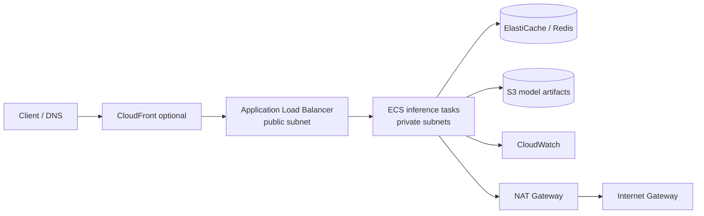

# Networking for ML systems — AWS mapping

This repo uses a deliberately conventional two-tier VPC so the networking decisions are inspectable.

## Concepts worth being able to explain

- **CIDR** defines the address range of a network. `10.42.0.0/16` is divided into smaller public and private subnets.
- A **route table** decides where packets matching a destination prefix are sent.
- An **Internet Gateway** gives resources with suitable routes/public addressing a path to the internet.
- A **NAT Gateway** lets instances/tasks in private subnets initiate outbound connections without accepting unsolicited inbound internet connections.
- A **Security Group** is stateful and attached to resources/interfaces. Return traffic for an allowed flow is automatically permitted.
- A **Network ACL** is stateless and applies at subnet boundaries; inbound and outbound rules must be considered independently.
- An **ALB** operates at Layer 7 and can route HTTP(S) using hosts/paths. An **NLB** operates at Layer 4 and is useful for very high-throughput TCP/UDP/TLS workloads and static IP requirements.
- **DNS** resolves names to endpoints; Route 53 is AWS's managed DNS service.
- **TLS** protects data in transit and authenticates endpoints using certificates. In a common AWS design TLS terminates at an ALB using ACM-managed certificates.

## Why inference tasks are private

The public entry point should be the load balancer, not every model container. The service security group therefore accepts port 8000 only from the ALB security group. Tasks can still fetch dependencies or contact external services through controlled outbound routing.

## Interview prompts

1. Why use two Availability Zones?
2. What breaks if the NAT Gateway disappears?
3. When would VPC endpoints reduce NAT usage?
4. ALB versus API Gateway versus NLB?
5. Security Group versus NACL?
6. How would you expose `/metrics` without exposing it publicly?
7. How do health checks interact with autoscaling and deployments?
8. Where would WAF, CloudFront and Route 53 sit in this architecture?
